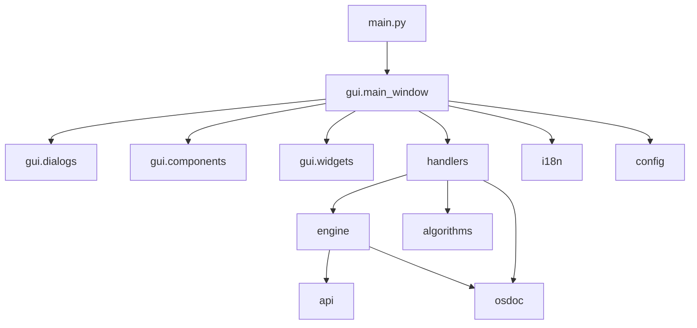

# BadWords Architecture & Rules (v4.0 Ready)

## 1. Project Overview & Mission
**BadWords** is a high-performance desktop tool for DaVinci Resolve video editors. It analyzes audio/video timelines to automatically detect silence, stuttering, repetitions (bad takes), filler words ("umms", "uhs"), and off-script lines using local AI (Whisper via CTranslate2 + GPU CUDA acceleration) and custom heuristic algorithms. It generates ripple-cut edits or markers directly on DaVinci Resolve timelines via DRT/XML and API IPC bridges.

---

## 2. Complete Codebase Directory Tree

```
BadWords/
├── assets/                          # Static runtime assets
│   ├── icons/                       # UI icons (.ico on Windows, .png on Linux/Mac)
│   └── layout/                      # UI layout bitmaps (e.g., drawer/sidebar graphics)
├── setupfiles/                      # Installers, runners, platform-specific setup scripts
│   ├── setup.py                     # Main installer & environment bootstrap
│   ├── updater.py                   # Self-updater script
│   └── legacy/                      # Legacy updater batch/shell scripts
├── updaters/                        # Dedicated non-interactive shell scripts for Linux/macOS
├── .agents/
│   └── rules/
│       └── architecture.md          # THIS MASTER BLUEPRINT
└── src/                             # Application Root
    ├── main.py                      # Entry point, InitThread, global Qt setup, dark mode hook
    ├── osdoc.py                     # System doctor, path routing, user.json/settings.json split, logging
    ├── algorithms.py                # Pure heuristic algorithms: fuzzy matching, diff, retake detector
    ├── assembler.py                 # Timeline DRT assembler, sub-frame XML manipulation & ripple-cuts
    ├── config/                      # Configuration constants, color palettes, default keys
    │   ├── __init__.py              # Central config export
    │   ├── constants.py             # App version, supported languages, default paths
    │   └── ui_config.py             # UI dimensions, color codes, fonts, default hotkeys
    ├── i18n/                        # Multi-language localization system (10 languages)
    │   ├── __init__.py              # Translation lookup helpers (_txt, get_trans)
    │   ├── __loader__.py            # Pre-loads and caches all 10 language JSONs into config.TRANS
    │   └── *.json                   # Translation dictionaries (en, pl, de, es, fr, it, ja, ko, pt, zh)
    ├── api/                         # DaVinci Resolve Bridge & IPC
    │   ├── __init__.py              # API package exports
    │   └── resolve_handler.py       # Resolve COM/Socket connection, timeline track scanner
    ├── engine/                      # Audio & AI Processing Pipeline
    │   ├── __init__.py              # Engine package exports
    │   ├── audio_engine.py          # Central AudioEngine coordinator, device detection (GPU/CPU)
    │   ├── audio_extraction.py      # FFmpeg audio extractor, waveform generator, silence detector
    │   └── transcription.py         # Local Whisper AI worker, CUDA DLL injector, hotwords handler
    ├── handlers/                    # Async Background Handlers & State Managers
    │   ├── __init__.py              # Handlers package exports
    │   ├── analysis_worker.py       # QThread pipeline executor (Extract -> Transcribe -> Analyze)
    │   ├── autosave_manager.py      # Debounced autosave coordinator (saves/recovery.bws)
    │   └── undo_manager.py          # 50-state history stack for non-destructive editing
    └── gui/                         # Presentation Layer (PySide6 UI)
        ├── __init__.py              # GUI package exports
        ├── main_window.py           # BadWordsGUI main window, workspace coordinator, signal wiring
        ├── utils.py                 # Visual helpers: _app_icon, _txt, apply_dark_title_bar, screen center
        ├── dialogs/                 # Modular Dialog Windows (Decoupled, 1 class per file)
        │   ├── __init__.py          # Re-exports all dialog classes
        │   ├── settings_dialog.py   # Settings dialog (7 tabs, real-time lazy loading, dynamic mode)
        │   ├── marker_dialog.py     # Custom marker creation & color picker dialog
        │   ├── telemetry_popup.py   # Analytics consent modal
        │   ├── update_dialog.py     # UpdateCheckThread & UpdateNotifyDialog
        │   ├── splash_screen.py     # Loading splash screen with animated dots
        │   ├── unsaved_changes_dialog.py # Settings diff & save/discard confirmation
        │   ├── msgbox.py            # Custom frameless message/alert box
        │   └── overlay.py           # AnimatedDimOverlay, GlobalAppFilter, drag-drop dropzones
        ├── components/              # Complex Composite UI Components
        │   ├── __init__.py          # Components package exports
        │   ├── dialogs.py           # Backward-compatible facade (forwards all imports to gui.dialogs)
        │   ├── mixins.py            # FramelessWindowMixin, _BaseDialog, platform window behavior
        │   ├── titlebar.py          # Custom TitleBar with window controls & language selector
        │   ├── audio_preview.py     # Audio waveform player & scrub slider
        │   ├── transcription_canvas.py # Rich text editor / transcript view container
        │   ├── search_overlay.py    # In-editor Ctrl+F search overlay
        │   └── drawer.py            # Collapsible side drawer
        └── widgets/                 # Atomic Reusable UI Primitives
            ├── __init__.py          # Widgets package exports
            ├── buttons.py           # Custom buttons, toggle switches, shortcut capture inputs
            ├── labels.py            # MarqueeLabel, IDETooltip, styled status labels
            ├── layouts.py           # FlowLayout, MainPanelWidget
            ├── progress_bar.py      # LiquidProgressBar
            ├── language_selector.py # Floating language picker dropdown
            ├── sliders.py           # JumpSlider (click-to-seek slider)
            ├── splitters.py         # GripSplitter with custom draggable separator handles
            ├── text_edits.py        # WrappingPlaceholderTextEdit, SBSTextEdit
            └── delegates.py         # Custom QStyledItemDelegates (MarqueeItemDelegate)
```

---

## 3. Strict Architectural Layers & Dependencies



### Dependency Rules:
1. **Presentation (`src/gui/`)**:
   - Strictly handles drawing, widget creation, user events, animations, and signals.
   - **NEVER** run heavy algorithms, file I/O, or blocking network/process calls directly on the GUI thread.
2. **Handlers (`src/handlers/`)**:
   - Coordinates background asynchronous tasks (`QThread`), maintains state histories, and communicates with the GUI solely via Qt Signals (`pyqtSignal` / `Signal`).
3. **Engine & API (`src/engine/`, `src/api/`)**:
   - Core computational workers. Completely agnostic of the GUI. They receive raw data (audio paths, config dicts) and return structured dictionaries/objects.
4. **Localization (`src/i18n/`)**:
   - All translatable strings reside in `src/i18n/*.json`.
   - Never hardcode user-facing strings in UI code. Use `_txt(lang, key)` or `self.txt(key)`.

---

## 4. Key Engineering Workarounds & "Hacks" (DO NOT DELETE)

The codebase contains essential, battle-tested workarounds for cross-platform and Resolve compatibility. **AI Agents MUST NOT remove or refactor away these patterns**:

1. **Python < 3.9 PySide6 Typings Hotfix (`src/main.py`)**:
   - Resolves `TypeError: unsupported operand type(s) for |: 'type' and 'type'` in environments running embedded Python 3.8/3.9.
2. **`ResolveStreamProxy` Console Buffering (`src/osdoc.py`)**:
   - DaVinci Resolve's embedded Python console crashes if bombarded with rapid unbuffered stdout/stderr writes. `ResolveStreamProxy` intercepts writes and flushes safely.
3. **CUDA / cuDNN DLL Dynamic Injection (`src/engine/transcription.py`, `src/engine/audio_engine.py`)**:
   - Automatically resolves `nvidia-cublas-cu12` and `nvidia-cudnn-cu12` virtual environment libraries and injects their paths into `os.environ["PATH"]` and `sys.path` before Whisper initializes.
4. **Cross-Platform Frameless Window (`src/gui/components/mixins.py`)**:
   - Uses `qframelesswindow` on Windows for native DWM drop shadow, Aero Snap, and minimize/maximize animations.
   - Falls back gracefully to frameless drag handles on Linux / macOS.
5. **Global Event Filter & Hover Tooltips (`src/gui/dialogs/overlay.py`)**:
   - `GlobalAppFilter` clears focus on outside mouse clicks and debounces tooltip triggers (750ms) to prevent event-queue pileup.
6. **Path Resolution Dual-Mode (`install_dir` vs Repo)**:
   - In production, assets are installed flat or in `/icons`, `/layout`. In development, they reside in `assets/icons/`. Always use `osdoc.install_dir` or robust path fallbacks.

---

## 5. Guidelines for AI Coding Agents

When working on this repository, you MUST follow these commandments:

1. **No Monoliths**: Never dump new functionality into `main_window.py` or create massive single-file classes. Create focused, single-responsibility files in the appropriate sub-package (`dialogs/`, `components/`, `widgets/`, `handlers/`, `engine/`).
2. **Preserve Backward Compatibility**: When reorganizing files, always leave a forwarding facade or update all import call sites cleanly.
3. **Never Block the Event Loop**: All computations > 15ms MUST run in a `QThread` or worker handler.
4. **English Only in Code**: All comments, variable names, docstrings, and commit messages MUST be in English. (Translations belong solely in `src/i18n/*.json`).
5. **No Runtime Trash in Git**:
   - Never stage `settings.json`, `user.json`, `*.log`, `saves/`, `temp/`, `models/`, or `__pycache__`.
   - Clean up scratch files before creating commits.
6. **Self-Verification Protocol**:
   - Always run `python3 -m compileall src` after making modifications.
   - Verify that imports work from root with `QT_QPA_PLATFORM=offscreen`.
