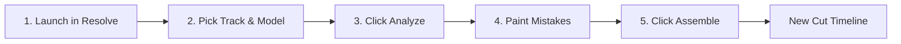
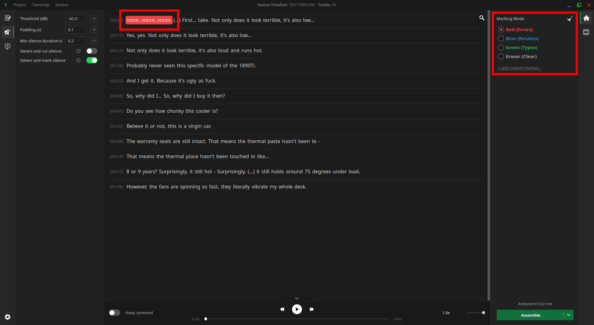
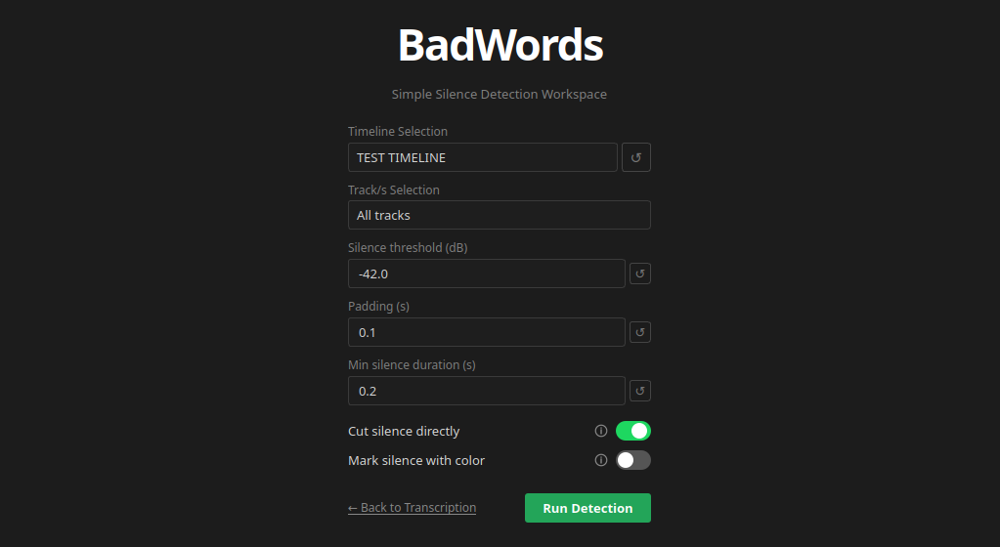
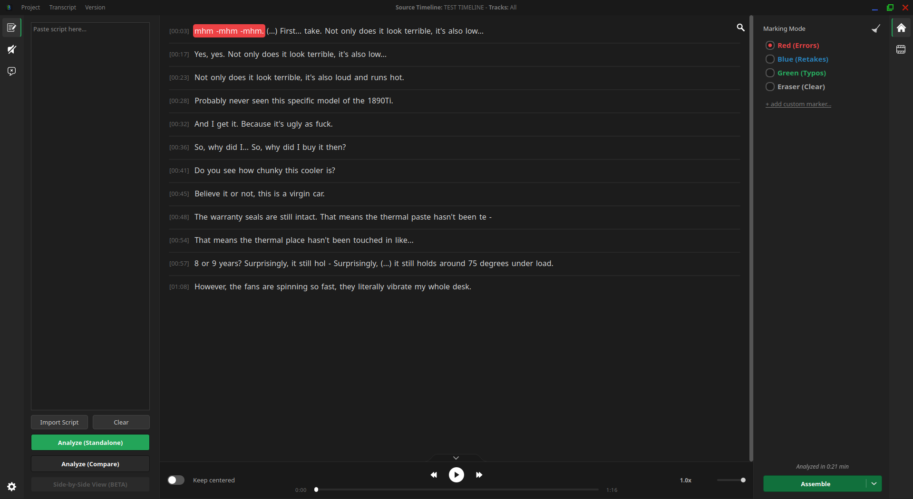
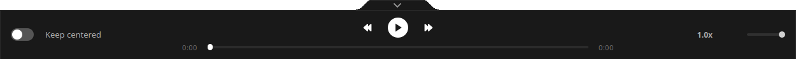
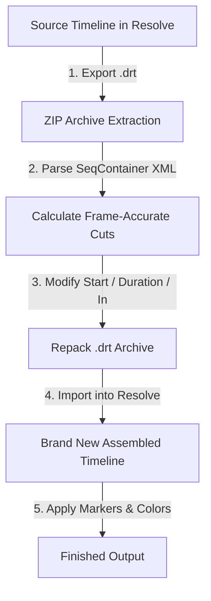
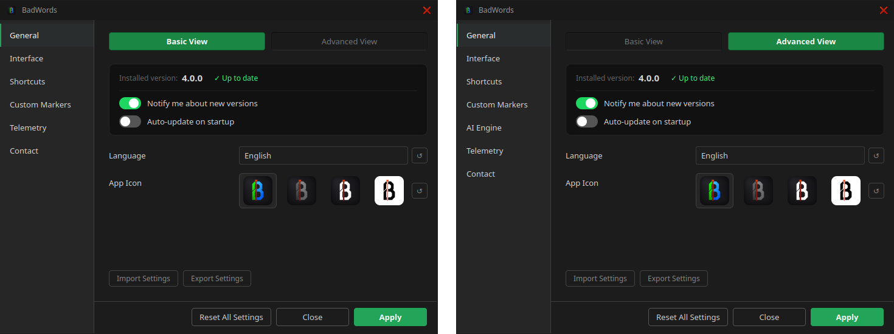
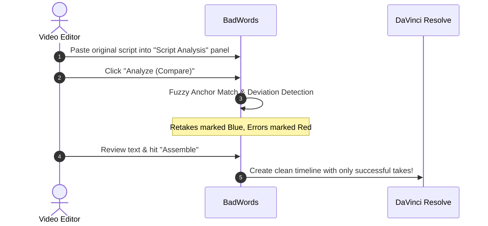

# BadWords - Complete User Guide & Manual

> [!WARNING]  
> **Disclaimer:** I've never written full documentation before, and I used AI to help put this entire guide together. Because of that, some mistakes, weird phrasing, or inaccuracies might still be present. If you stumble upon anything confusing or hard to understand, feel free to contact me directly or open an Issue on GitHub - Pull Requests are also welcome!

## Table of Contents

- [1. Quickstart Guide (3-Minute Setup)](#1-quickstart-guide-3-minute-setup)
  - [1.1 Launching from DaVinci Resolve](#11-launching-from-davinci-resolve)
  - [1.2 Choosing Source Audio & Model](#12-choosing-source-audio--model)
  - [1.3 Reviewing & Color-Coding Mistakes](#13-reviewing--color-coding-mistakes)
  - [1.4 Assembling the Cut Timeline](#14-assembling-the-cut-timeline)
- [2. UI Reference: Welcome Screen & Source Selection](#2-ui-reference-welcome-screen--source-selection)
  - [2.1 Transcription Workspace](#21-transcription-workspace)
  - [2.2 Fast Silence Workspace (Standalone Silence Removal)](#22-fast-silence-workspace-standalone-silence-removal)
  - [2.3 First-Run Hardware Optimization & Model Downloads](#23-first-run-hardware-optimization--model-downloads)
- [3. UI Reference: Top Titlebar & Project Management](#3-ui-reference-top-titlebar--project-management)
  - [3.1 Project Menu (`.bws` Saves & Crash Recovery)](#31-project-menu-bws-saves--crash-recovery)
  - [3.2 Transcript Menu (Export `.txt` & Clipboard)](#32-transcript-menu-export-txt--clipboard)
  - [3.3 Versions & Chapter Switching (DaVinci Playhead Sync)](#33-versions--chapter-switching-davinci-playhead-sync)
  - [3.4 Window Controls & Always on Top](#34-window-controls--always-on-top)
- [4. UI Reference: Transcript Editor & Word Painting](#4-ui-reference-transcript-editor--word-painting)
  - [4.1 Transcript Layout (Continuous Flow vs Segmented Blocks)](#41-transcript-layout-continuous-flow-vs-segmented-blocks)
  - [4.2 Word Painting & Color-Coded Markers](#42-word-painting--color-coded-markers)
  - [4.3 Inaudible Fragments `(...)` & Start Absorption](#43-inaudible-fragments--and-start-absorption)
  - [4.4 Transcript Search Overlay (`Ctrl + F`)](#44-transcript-search-overlay-ctrl--f)
- [5. UI Reference: Audio Preview & Navigation Bar](#5-ui-reference-audio-preview--navigation-bar)
  - [5.1 Jump to Word (Instant Resolve Timeline Scrubbing)](#51-jump-to-word-instant-resolve-timeline-scrubbing)
  - [5.2 Integrated Audio Player Controls](#52-integrated-audio-player-controls)
  - [5.3 Speed Adjustment & Playhead Synchronization](#53-speed-adjustment--playhead-synchronization)
- [6. UI Reference: Collapsible Sidebar Activities](#6-ui-reference-collapsible-sidebar-activities)
  - [6.1 Main Panel (Marking Palette & Pinned Favorites)](#61-main-panel-marking-palette--pinned-favorites)
  - [6.2 Script Analysis (Compare vs Standalone & Side-by-Side View)](#62-script-analysis-compare-vs-standalone--side-by-side-view)
  - [6.3 Silence Detection (Post-Transcript Trimming)](#63-silence-detection-post-transcript-trimming)
  - [6.4 Filler Words Manager (Inline List & Auto-Marking)](#64-filler-words-manager-inline-list--auto-marking)
  - [6.5 Assembly & Color Cutting Matrix (Auto-Cut vs Cut Now)](#65-assembly--color-cutting-matrix-auto-cut-vs-cut-now)
  - [6.6 Sidebar Drag & Drop Customization](#66-sidebar-drag--drop-customization)
- [7. UI Reference: Timeline Assembly & DaVinci Integration](#7-ui-reference-timeline-assembly--davinci-integration)
  - [7.1 The Assembly Split Button & Track Options Drawer](#71-the-assembly-split-button--track-options-drawer)
  - [7.2 Native `.drt` Pipeline (Non-Destructive Protection)](#72-native-drt-pipeline-non-destructive-protection)
  - [7.3 Timeline Heatmap Overview](#73-timeline-heatmap-overview)
- [8. UI Reference: Settings & Preferences](#8-ui-reference-settings--preferences)
  - [8.1 General Settings](#81-general-settings)
  - [8.2 Interface & Transcript Formatting](#82-interface--transcript-formatting)
  - [8.3 Audio Sync Calibration (Offset, Padding, Snap Max)](#83-audio-sync-calibration-offset-padding-snap-max)
  - [8.4 Keyboard & Mouse Shortcut Bindings](#84-keyboard--mouse-shortcut-bindings)
  - [8.5 Custom Markers Configuration](#85-custom-markers-configuration)
  - [8.6 AI Engine Configuration (Advanced Mode)](#86-ai-engine-configuration-advanced-mode)
  - [8.7 Telemetry, Contact & Issue Reporting](#87-telemetry-contact--issue-reporting)
- [9. Step-by-Step Practical Recipes ("How do I...?")](#9-step-by-step-practical-recipes-how-do-i)
  - [Recipe A: Cutting Video Based on a Written Script](#recipe-a-cutting-video-based-on-a-written-script)
  - [Recipe B: Removing Retakes & False Starts without a Script](#recipe-b-removing-retakes--false-starts-without-a-script)
  - [Recipe C: Fast Silence Cut without Transcribing](#recipe-c-fast-silence-cut-without-transcribing)
  - [Recipe D: One-Click Filler Word Purge (`yyy`, `umm`, `uh`)](#recipe-d-one-click-filler-word-purge-yyy-umm-uh)
  - [Recipe E: Working with Difficult Words, Names & Jargon](#recipe-e-working-with-difficult-words-names--jargon)
- [10. Shortcuts Cheat Sheet & FAQ](#10-shortcuts-cheat-sheet--faq)

## 1. Quickstart Guide (3-Minute Setup)

Follow this rapid workflow to convert raw dialogue footage into an edited timeline with ripple cuts and color-coded markers in under three minutes.

### 1.1 Launching from DaVinci Resolve
1. Open your project in **DaVinci Resolve**.
2. In DaVinci Resolve's top application menu bar, navigate to:
   $$\text{\textbf{Workspace}} \longrightarrow \text{\textbf{Scripts}} \longrightarrow \text{\textbf{BadWords}}$$
3. The BadWords window will appear on top of DaVinci Resolve.

### 1.2 Choosing Source Audio & Model
1. **Timeline Selection:** Confirm your active timeline is selected in the dropdown. (Click `Refresh` if you just created a new timeline).
2. **Track/s Selection:** Select the audio track(s) where dialogue is recorded (e.g., `A1` for your primary microphone).
3. **Language:** Select the spoken language of the recording.
4. **Model:** Choose **Large Turbo** (recommended) or **Large** (or **Medium** on lower-spec hardware).
5. Click the green **`Analyze`** button.

> [!IMPORTANT]  
> **Model Quality Warning:** While smaller models (*Tiny*, *Base*, *Small*) are available in the dropdown, their transcription precision is significantly degraded. Because BadWords relies entirely on verbatim word accuracy to calculate frame-exact cuts, using models below *Medium* can cause the AI to hallucinate or miss words, making the tool practically unusable.

  

### 1.3 Reviewing, Color-Coding & Cut Settings
1. Once processing finishes, your audio appears formatted as interactive text.
2. Filler words (*"um", "uh", "yyy"*) are automatically highlighted in **Red**.
3. Use your mouse to click or drag across mistakes, false starts, or repeated takes:
   - **Press `1` or select Red** for errors and filler words.
   - **Press `2` or select Blue** for retakes and repeated sentences.
   - **Press `4` or select Eraser** to clear any accidental highlight.

  

4. **Silence & Auto-Cut Options in Sidebar:**
   - **Silence Detection Panel:** Choose whether dead air is removed directly (`Cut silence directly`) or highlighted in a light **Tan** color (`Mark silence with color`) so you can adjust cuts manually in Resolve.
   - **Auto-Cut vs Clip Coloring (Assembly Panel):** By default, marked words stay on the timeline as **color-coded clips**. However, if you click the circular **"A" (Auto-cut)** icon next to any color in the *Assembly* panel (it turns green), everything painted with that color will be **ripple-cut (deleted)** during assembly!

  

5. Hold **`Ctrl + Left Click`** on any word to instantly jump both BadWords audio and DaVinci Resolve's playhead to that exact timestamp.

### 1.4 Assembling the Cut Timeline
1. When you have finished marking your transcript, click the green **`Assemble`** button in the bottom-right corner.
2. BadWords automatically builds and imports a **brand new timeline** into DaVinci Resolve named `<Timeline_Name>_Edit 1`.
3. **100% Non-Destructive:** Your original timeline remains completely untouched. On the new timeline, cuts are applied frame-accurately and every remaining clip is **color-coded directly in DaVinci Resolve (Clip Color)** according to your text markings for instant visual verification.

## 2. UI Reference: Welcome Screen & Source Selection

When BadWords opens, you are greeted by the **Welcome Screen**. This view allows you to configure your transcription pipeline or switch to the ultra-fast standalone silence removal tool.

  

<!-- 
IMAGE PLACEHOLDER: docs/images/02_welcome_screen.png
Capture the initial BadWords Welcome Screen with annotations:
[1] Timeline Selector & Refresh Button
[2] Track/s Selector Dropdown
[3] Language Searchable Dropdown
[4] Model Dropdown & Info Tooltip
[5] More Accurate Transcription Toggle & Script Drawer
[6] Import Project (.bws) & Analyze Buttons
[7] Fast Silence Detection Link
-->

### 2.1 Transcription Workspace

| UI Element | Type | Purpose & Description |
| :--- | :--- | :--- |
| **Timeline Selection** | *Dropdown* | Lists all timelines present in your currently open DaVinci Resolve project. Select the timeline you wish to transcribe. |
| **Refresh Timelines `Refresh`** | *Button* | Re-queries DaVinci Resolve's API to update the list of timelines and audio tracks if you created or renamed one while BadWords was open. |
| **Track/s Selection** | *Multi-Select* | Allows you to select one, multiple, or all audio tracks (`A1`, `A2`, etc.).  **Important:** When multiple tracks are selected, BadWords mixes them into a **single combined audio stream** for Whisper. It does *not* transcribe each track separately. If multiple speakers talk over each other on separate tracks, the AI will "hear" mixed overlapping speech. |
| **Language** | *Searchable Dropdown* | Specifies the spoken language of the recording. Selecting a language automatically configures language-specific verbatim acoustic prompts (from a library of 60+ languages) and backend parameters to prevent the AI from translating or smoothing out native hesitation sounds. |
| **Model** | *Dropdown* | Selects the local Faster-Whisper neural network model. *(See the detailed Model Selection Guide below).* |
| **More Accurate Transcription** | *Toggle Switch* | Opens a collapsible slide-out drawer where you can paste or import a reference script (`.txt`, `.pdf`, `.docx`). Keywords from the script are extracted and fed directly into the model's initial prompt, dramatically increasing accuracy on technical jargon, names, and numbers. |
| **Import Project** | *Button* | Opens an existing BadWords `.bws` project file to resume previous editing sessions. |
| **Analyze** | *Action Button* | Extracts audio from Resolve, executes VAD & Whisper acoustic transcription, runs initial silence detection, and opens the main editor. |

#### Model Selection Guide & Hardware Requirements

> [!CAUTION]  
> BadWords relies strictly on **verbatim speech-to-text accuracy** to find acoustic cuts. Models below **Medium** are not recommended for production work as high word error rates degrade the entire cutting workflow.

| Model | Memory (VRAM / RAM) | Disk Space | Speed | Recommended Use Case |
| :--- | :---: | :---: | :---: | :--- |
| **Large Turbo** *(Default)* | ~2.5 GB | ~1.6 GB | Fast & Highly Accurate | **Strongly Recommended.** Best balance of verbatim precision and rendering speed on modern NVIDIA GPUs. |
| **Large (v3)** | ~3.5 GB | ~3.1 GB | Maximum Precision | **Recommended.** Best for heavy accents, technical jargon, or noisy backgrounds. |
| **Medium** | ~2.5 GB | ~1.5 GB | Moderate | Minimum recommended model for lower-spec GPUs or CPU-only setups. |
| **Small** | ~1.0 GB | ~480 MB | Fast | *Legacy / Testing only.* Low verbatim precision on stutters and filler words. |
| **Base** | ~0.5 GB | ~140 MB | Very Fast | *Not recommended.* Prone to hallucinating words and skipping pauses. |
| **Tiny** | ~0.3 GB | ~75 MB | Ultra Fast | *Not recommended.* Only for quick code testing. |

### 2.2 Fast Silence Workspace (Standalone Silence Removal)

Clicking the link **`Simple Silence Detection`** at the bottom of the Welcome Screen flips the interface into **Fast Silence Mode**. This mode bypasses speech-to-text entirely, using light-weight audio normalization and silence analysis to cut dead air across an entire timeline in seconds.

> [!NOTE]  
> **Built-in Audio Normalization:** Unlike DaVinci Resolve's native silence cutter (which requires manually tweaking dB levels for every different audio clip), BadWords **automatically normalizes audio levels in the background** before scanning. This makes the default threshold (`-42.0 dB`) universally accurate across all microphone setups out of the box.

  

<!-- 
IMAGE PLACEHOLDER: docs/images/03_fast_silence_screen.png
Capture Fast Silence mode with annotations:
[1] Silence Threshold (dB)
[2] Padding (s)
[3] Min Silence Duration (s)
[4] Cut Silence Directly vs Mark Silence with Color Toggles
[5] Run Detection Button
-->

#### Fast Silence Controls:
1. **Silence Threshold (dB):** Volume level below which normalized audio is classified as silence.  
   *Default: `-42.0 dB` (Pre-normalized audio ensures this threshold works universally).*
2. **Padding (s):** Safety margin preserved before and after speech to ensure word beginnings and trailing consonants are never clipped.  
   *Default: `0.10s`.*
3. **Min Silence Duration (s):** Minimum pause length required before a cut is triggered.  
   *Default: `0.20s`.*
4. **Mode Toggles (Mutually Exclusive):**
   - **`Cut silence directly`:** Automatically removes silence gaps and ripples the timeline together upon execution.
   - **`Mark silence with color`:** Leaves clips intact but color-codes silent regions with **Tan** clip colors in DaVinci Resolve for manual review.
5. **`Run Detection`:** Executes the pass and instantly builds a **brand new timeline** in DaVinci Resolve (e.g. `<Timeline_Name>_Edit 1`), leaving your source timeline **100% untouched**.

### 2.3 First-Run Model Download & Setup
When you analyze footage with a specific AI model for the first time:
- BadWords automatically downloads the neural network weights from HuggingFace directly into your local installation directory (`models/`).

> [!NOTE]  
> **Initial Download & Animated Progress Bar:**  
> During this one-time download, **the animated progress bar will run in an infinite loop without a percentage counter**, which might make it feel like the process is taking long or stuck. Do not close or force-quit the application! BadWords is actively fetching large neural network files in the background. Depending on your internet connection speed, this process typically takes a few minutes. If a genuine network issue occurs, BadWords will immediately stop and show an error dialog.

- Once downloaded, the model files are cached permanently on your local drive. All subsequent transcriptions with that model run completely offline and start instantly with zero download delay.

## 3. UI Reference: Top Titlebar & Project Management

The top bar of BadWords provides a clean, native-feeling titlebar with access to file management, transcript exports, and timeline synchronization.

  

<!-- 
IMAGE PLACEHOLDER: docs/images/04_titlebar_overview.png
Capture the Titlebar showing:
[1] Project Menu Dropdown
[2] Transcript Menu Dropdown
[3] Version / Chapter Dropdown
[4] Source Timeline & Track Metadata Label
[5] Settings Gear Icon & Window Controls
-->

### 3.1 Project Menu (`.bws` Saves & Crash Recovery)
- **Export Project (`.bws`):** Saves the complete state of your current session into a portable `.bws` (BadWords Save) file. This includes the full word-level timestamps, your manual color markings, script comparison data, and timeline metadata.
- **Import Project:** Restores an existing session from a `.bws` file.
- **Crash Recovery & AutoSave:** BadWords runs a silent background AutoSave engine. If DaVinci Resolve or your system crashes unexpectedly, BadWords detects the cached session on the next launch and prompts you to restore your work with a single click.

> [!TIP]  
> If media files have been moved or a timeline renamed since saving a `.bws` file, BadWords includes an intelligent recovery prompt allowing you to re-link or import the original `.drt` state directly.

### 3.2 Transcript Menu (Export `.txt` & Clipboard)
- **Export as `.txt`:** Exports the entire transcript as a clean, formatted plain text document.
- **Copy to clipboard:** Copies the transcript directly to your system clipboard for instant pasting into documentation, show notes, or subtitles.

### 3.3 Versions & Chapter Switching (DaVinci Playhead Sync)
- **Version Dropdown:** Displays the currently active timeline name or processed chapter.
- **Sync DaVinci Timeline on Chapter Switch:** When enabled in settings, switching between versions or chapters inside BadWords automatically changes the active timeline in DaVinci Resolve to match.

### 3.4 Window Controls & Always on Top
- **Gear Icon Settings:** Opens the comprehensive [Settings Dialog](#8-ui-reference-settings--preferences).
- **Always on Top:** Can be enabled in Settings, ensuring BadWords floats over DaVinci Resolve even when scrubbing the timeline in Resolve.

## 4. UI Reference: Transcript Editor & Word Painting

The central workspace of BadWords is the **Transcript Canvas**, an IDE-inspired interactive text environment where every single word is bound to frame-accurate audio timestamps.

  

<!-- 
IMAGE PLACEHOLDER: docs/images/05_transcript_canvas.png
Capture Transcript Canvas with annotations:
[1] Timestamp Header [00:14]
[2] Sentence Block
[3] Red Highlighted Filler Word
[4] Blue Highlighted Retake Block
[5] Green Highlighted Typo
[6] Inaudible (...) Token
[7] Search Overlay Active
-->

### 4.1 Transcript Layout (Continuous Flow vs Segmented Blocks)
You can choose how text is formatted via Settings or shortcut:
- **Segmented Blocks (Default):** Breaks text into clean, readable sentence chunks based on punctuation and natural speech pauses. Each block includes a timestamp header (e.g. `[01:24]`).
- **Continuous Flow:** Displays the transcript as a continuous prose paragraph without block breaks.

### 4.2 Word Painting & Color-Coded Markers

BadWords uses a **Painting Metaphor** for editing. Selecting a color tool and clicking or dragging across words applies that color tag to the acoustic segment. When assembled, **the clips themselves on your DaVinci Resolve timeline are color-coded (Clip Color)** to match your text markings:

| Painting Color | DaVinci Clip Color | Default Assembly Action | Purpose |
| :---: | :---: | :---: | :--- |
| **Red** | **Violet** | **Cut / Ripple Delete** *(if Auto-cut enabled)* | Filler words (*"uh"*, *"um"*, *"yyy"*), obvious stumbles, coughs, and bloopers. |
| **Blue** | **Navy** | **Cut / Ripple Delete** *(if Auto-cut enabled)* | Retakes, repeated sentences, false starts, and second takes. |
| **Green** | **Olive** | **Keep (Color Clip)** | Minor deviations, typos, or improvisations compared to the script. |
| **Brown** | **Chocolate** | **Keep (Color Clip)** | Inaudible sounds, mumbled speech, or microphone clicks. |
| **Eraser** | *Default* | **Keep (Normal Clip)** | Strips all color tags from the selected word, restoring it to normal clip color. |
| **Custom** | *User Assigned* | *Configurable in Assembly* | User-defined categories (e.g. "B-Roll", "Zoom In", "Sound Effect"). |

> [!WARNING]  
> **Resolve Clip Color Mapping:** BadWords maps your colors to *Violet*, *Navy*, and *Olive* in DaVinci Resolve to prevent visual conflicts with DaVinci Resolve’s default video (Blue) and audio (Green) clip colors.

### 4.3 Inaudible Fragments `(...)` & Start Absorption
- **Garbled Audio:** When speech is completely inaudible or masked by loud noise, BadWords marks the segment as `(...)` (Inaudible).
- **Hidden Start Notice:** If the very start of a clip contains ambient noise or throat-clearing before speech begins, BadWords hides it and displays a subtle banner: `Start of audio detected as inaudible, skipped. [show it anyway]`.

### 4.4 Transcript Search Overlay (`Ctrl + F`)
Pressing **`Ctrl + F`** (or `Cmd + F` on macOS) opens the floating search bar:
- Type any word or phrase to instantly highlight matches across the entire transcript.
- Match counter displays live results (e.g., `4/18`).
- Press **`Enter`** to jump to the next match, **`Shift + Enter`** for the previous match, and **`Esc`** to close.

## 5. UI Reference: Audio Preview & Navigation Bar

The bottom panel of the editor houses the **Audio Preview Bar**, eliminating guesswork by allowing you to listen to words and navigate Resolve directly from the text.

  

<!-- 
IMAGE PLACEHOLDER: docs/images/06_audio_preview_bar.png
Capture the bottom Audio Preview Bar showing:
[1] Floating Audio Preview Toggle Island
[2] Play/Pause Button
[3] Waveform / Seeker JumpSlider
[4] Timestamp Display (Current / Total)
[5] Speed Dropdown (1.0x)
-->

### 5.1 Jump to Word (Instant Resolve Timeline Scrubbing)
- **Shortcut:** **`Ctrl` + Left Click** (Configurable in Settings to `Alt` or `Shift` + Left/Right click).
- Clicking any word in the transcript instantly moves **both**:
  1. The internal BadWords audio playback head.
  2. The **DaVinci Resolve timeline playhead** to the exact frame where the word was spoken!

### 5.2 Integrated Audio Player Controls
- **Play / Pause:** Click the animated play button or press **`Space`**.
- **Seeker Bar (JumpSlider):** Click anywhere on the progress bar to scrub through the audio.
- **Skip Backward / Forward:** Press **`Left Arrow`** / **`Right Arrow`** to jump in 2-second increments.
- **Toggle Floating Tab:** Click the floating island tab at the bottom of the editor to hide or show the audio bar.

### 5.3 Speed Adjustment & Playhead Synchronization
Click the speed dropdown to select playback rates: `0.5x`, `0.75x`, `1.0x`, `1.25x`, `1.5x`, or `2.0x`. Pitch correction is applied automatically to maintain vocal clarity at high speeds.

## 6. UI Reference: Collapsible Sidebar Activities

BadWords features an activity sidebar system on the left and right borders of the window. Sidebar panels can be collapsed, reordered, and customized.

  

<!-- 
IMAGE PLACEHOLDER: docs/images/07_sidebar_tools.png
Capture the sidebar activities with callouts:
[1] Main Panel
[2] Script Analysis Panel
[3] Silence Detection Panel
[4] Filler Words Panel
[5] Assembly & Color Cutting Matrix
-->

### 6.1 Main Panel (Marking Palette & Pinned Favorites)
- **Active Marker Selector:** Radio buttons to switch between **Red**, **Blue**, **Green**, **Eraser**, and custom markers.
- **`Clear Transcript` (Trash Icon):** Clears all painted markers across the entire project with a confirmation dialog.
- **`+ add custom marker...`:** Opens the marker creation dialog.
- **Pinned Favorites Section:** Shows your starred tools and toggles (e.g. quick auto-cut switches) for fast one-click access without switching tabs.
- **Assemble Split Button:** Assembles the final timeline.

### 6.2 Script Analysis (Compare vs Standalone & Side-by-Side View)

This is one of the most powerful features in BadWords. It compares what was *actually recorded* against your *intended script*.

  

<!-- 
IMAGE PLACEHOLDER: docs/images/08_script_analysis_sbs.png
Capture Script Analysis & Side-by-Side comparison view:
[1] Script Input Text Area & Import Button (.txt, .pdf, .docx)
[2] Analyze (Standalone) Button
[3] Analyze (Compare) Button
[4] Side-by-Side View (BETA) Button
[5] Split View Columns: Script (Left) vs Transcript (Right)
-->

1. **Script Input Field:** Paste your raw script or click **`Import Script`** (Supports `.txt`, `.docx`, and `.pdf` files with aggressive whitespace normalization).
2. **`Analyze (Standalone)`:** Analyzes the raw transcript *without* a reference script. Uses acoustic lookahead and fuzzy ngram matching to detect stuttering, false starts, and repeated sentences automatically.
3. **`Analyze (Compare)`:** Compares the transcript against the pasted script using fuzzy anchor alignment. Automatically paints deviations:
   - Words matching the script are left unpainted.
   - Repeated attempts and retakes are painted **Blue**.
   - Filler words and speech errors are painted **Red**.
   - Minor phrasing typos are painted **Green**.
4. **`Side-by-Side View (BETA)`:** Opens a dedicated comparative two-column view displaying the reference script on the left and the live transcript on the right with colored indicators:
   - **Unspoken** (Present in script, never spoken in recording)
   - **Skipped** (Omitted during delivery)
   - **Improvised / Error** (Deviations from script)

### 6.3 Silence Detection (Post-Transcript Trimming)
Adjusts silence parameters applied after full speech transcription:
- **Threshold (dB):** Sensitivity threshold for silence (default `-42.0 dB`).
- **Padding (s):** Speech padding (default `0.05s`).
- **Min Silence Duration (s):** Minimum gap length to cut (default `0.20s`).
- **Toggles:** `Detect and cut silence` vs `Detect and mark silence`.

### 6.4 Filler Words Manager (Inline List & Auto-Marking)
- **Inline Editor:** An interactive list of all filler words recognized by the engine (e.g. `yyy, eee, umm, uh, ah, mhm, hmm, like, you know`).
- **Live Counter & Save:** Displays total filler words defined. Click `Save` to persist changes or `Refresh` to restore factory defaults.
- **`Mark filler words automatically` Toggle:** When enabled, any word matching the list is automatically painted **Red** during transcription.

### 6.5 Assembly & Color Cutting Matrix (Auto-Cut vs Cut Now)

This panel gives you granular control over what happens to each color during timeline creation:

  

<!-- 
IMAGE PLACEHOLDER: docs/images/09_assembly_matrix.png
Capture the Assembly Matrix showing:
[1] Show/Mark Inaudible Toggles
[2] Show Detected Typos Toggle
[3] Color Row: Color Name & Hex Badge
[4] Cut Now (Scissors) Button
[5] Auto-Cut Checkbox Icon
[6] Star (Pin to Favorites) Button
-->

#### Controls per Color Row:
1. **Scissors Icon (`Cut Now`):** Prompts you to immediately cut and remove all clips of this color from either a **New Timeline** or the **Currently Selected Timeline** in DaVinci Resolve.
2. **Auto-Cut Icon (Checkmark):** When checked, any text painted with this color is **automatically ripple-deleted** during the standard `Assemble` process.
3. **Star Icon (`Star`):** Pins this color's Auto-Cut toggle directly onto the Main Panel under *Pinned Favorites*.

### 6.6 Sidebar Drag & Drop Customization
You can reorder sidebar activity icons or drag panels between the left and right sides of the window by simply clicking and dragging the sidebar button handles.

## 7. UI Reference: Timeline Assembly & DaVinci Integration

When editing is complete, clicking the **Assemble** button converts your text modifications into timeline operations in DaVinci Resolve.

  

<!-- 
IMAGE PLACEHOLDER: docs/images/10_assembly_drawer.png
Capture the Assemble Split Button expanded with the Track Options Drawer:
[1] Assemble Button Main Click Area
[2] Drawer Expand Arrow (Expand / Collapse)
[3] Track Mode Selector (All / Transcription Only / Custom)
[4] Video Tracks Checkboxes (V1, V2...)
[5] Audio Tracks Checkboxes (A1, A2...)
-->

### 7.1 The Assembly Split Button & Track Options Drawer
- **Main Button Area:** Clicking **`Assemble`** immediately triggers the build process using current track settings.
- **Drawer Arrow (`Expand / Collapse`):** Expands the **Track Options Drawer** directly above the button:
  - **All tracks:** Includes every video and audio track present on the source timeline in the final ripple edit.
  - **Only transcription tracks:** Cuts only the audio track(s) selected during transcription.
  - **Custom selection:** Allows you to check/uncheck specific video tracks (`V1`, `V2`, `V3`) and audio tracks (`A1`, `A2`, `A3`).

### 7.2 Native `.drt` Pipeline (Non-Destructive Protection)

Unlike tools relying on legacy Final Cut Pro 7 XML exports (which break adjustment clips, Fusion titles, and generators), BadWords uses a **Native DaVinci Resolve Timeline (`.drt`) Engine**:

#### What this guarantees:
- **100% Non-Destructive:** Your source timeline is NEVER modified or overwritten.
- **Preserves All Effects:** Video transitions, color grades, Fusion compositions, adjustment clips, and subtitles remain intact.
- **Sub-50ms Timing Accuracy:** Incorporates a global calibrated temporal offset (`0.133s`) to align acoustic phonemes with video frames.

### 7.3 Timeline Heatmap Overview
Upon import into DaVinci Resolve, BadWords attaches native timeline markers to every edited region. This creates a color-coded "heatmap" directly inside Resolve’s Edit Page, allowing you to instantly spot where edits took place and inspect cuts visually.

## 8. UI Reference: Settings & Preferences

Clicking the Gear Icon Settings opens the **Settings Dialog**. You can switch between **Basic View** and **Advanced View** at the top.

  

<!-- 
IMAGE PLACEHOLDER: docs/images/11_settings_dialog.png
Capture Settings dialog showing:
[1] Basic / Advanced View Switcher
[2] Left Category Navigation List
[3] Setting Row with Input & Reset (Refresh) Button
[4] Footer Bar: Reset All Settings, Close, Apply
-->

### 8.1 General Settings
- **Interface Language (`Language`):** Switches UI language (English, Polish, German, French, Spanish, Russian, Italian, Japanese, Chinese, etc.).
- **Accent Color:** Selects the theme accent color (Green, Blue, Purple, Orange, Red, Teal, Pink, Amber).
- **App Icon:** Chooses the application window icon style.
- **Always on top:** Keeps BadWords floating above DaVinci Resolve.
- **Notify me about new versions:** Checks GitHub/GitLab releases on startup.
- **Auto-update on startup:** Silently downloads and installs patches automatically before opening.

### 8.2 Interface & Transcript Formatting
- **Transcript Font & Font Size:** Changes typography and font scaling (pt).
- **Line Spacing (px):** Adjusts vertical padding between lines.
- **Precise Timestamps (ms):** Displays full millisecond timestamps (e.g. `[01:08.432]`) instead of rounded seconds (`[01:08]`).
- **Punctuation marks per block (`chunk_punct_count`):** Number of sentences grouped into a single transcript block.
- **Max chunk words / Lookahead words:** Controls maximum line length and punctuation-aware word wrapping.

### 8.3 Audio Sync Calibration (Offset, Padding, Snap Max)

Fine-tune these parameters if you need razor-sharp acoustic synchronization:

| Parameter | Default Value | Description |
| :--- | :---: | :--- |
| **Offset (s)** | `0.133s` | Shifts all transcript timestamps backward or forward. Negative values start cuts slightly earlier; positive values delay them. |
| **Padding (s)** | `0.000s` | Adds extra duration to the tail of each spoken word, ensuring trailing consonants are never clipped. |
| **Snap Max (s)** | `0.250s` | Maximum silence gap between two adjacent words to merge them into a single uninterrupted audio clip. |

### 8.4 Keyboard & Mouse Shortcut Bindings
Configure custom keys for every action:
- Switch to Red / Blue / Green Marker
- Switch to Eraser
- Jump to Word (`Ctrl` / `Alt` / `Shift` + Left / Right Mouse Button)
- Play / Pause (`Space`)
- Skip Backward / Forward (`Left` / `Right`)
- Search (`Ctrl + F`)
- Open Settings (`Escape`)

### 8.5 Custom Markers Configuration
Create bespoke markers for your personal workflow:
1. Click **`+ Add Marker`**.
2. Enter a marker name (e.g., *"B-Roll Insert"* or *"Sound Effect"*).
3. Assign any unused DaVinci Resolve color.
4. Assign a keyboard shortcut key.
5. Export or import your marker configurations across different editing workstations.

### 8.6 AI Engine Configuration (Advanced Mode)

For power users who wish to customize the Faster-Whisper transcription engine:

| Setting | Default | Description |
| :--- | :---: | :--- |
| **Device** | `Auto` | Selects processing device (`Auto`, `CUDA` for NVIDIA GPUs, or `CPU`). |
| **Compute Type** | `int8` / `Auto` | Quantization precision (`int8`, `float16`, `bfloat16`, `float32`). |
| **VAD Filter** | `False` | Silero Voice Activity Detection pre-filter. |
| **Beam Size** | `1` | Greedy decoding (`1`) forces raw acoustic capture without grammatical smoothing. |
| **Temperature** | `0.0` | Sampling temperature. `0.0` ensures deterministic, hallucination-free output. |
| **Condition on Previous Text** | `False` | Disables previous context chaining to eliminate infinite repetition loops. |
| **Initial Prompt** | *Golden Verbatim* | Custom acoustic prompt guiding the AI to capture stutters and filler phonemes. |

### 8.7 Telemetry, Contact & Issue Reporting
- **Anonymous Telemetry:** 100% anonymous ping containing OS type and version number only (no audio or personal data is ever collected).
- **Direct Support Form:** Enter an issue title and description, attach screenshots, and send a diagnostic ticket with log files directly to the developer with one click.

## 9. Step-by-Step Practical Recipes ("How do I...?")

### Recipe A: Cutting Video Based on a Written Script
**Goal:** You recorded a video reading from a script and made several mistakes or repeated sentences. You want to keep only the good takes that match your script.

1. Launch BadWords on your raw recording timeline.
2. In the left sidebar, open the **Script Analysis** tab.
3. Paste your script into the box or click **`Import Script`** to load your `.docx` or `.pdf`.
4. Click **`Analyze (Compare)`**.
5. BadWords automatically aligns the transcript with the script:
   - Repeated attempts are painted **Blue**.
   - Bloopers and misspoken words are painted **Red**.
6. Skim the text. If you prefer a take the AI marked blue, use the **Eraser (`4`)** on that take and paint the other one **Blue (`2`)**.
7. Click **`Assemble`** to create your clean cut.

### Recipe B: Removing Retakes & False Starts without a Script
**Goal:** You recorded a casual podcast or gameplay video without any script and want to remove false starts and stumbles automatically.

1. Launch BadWords and click **`Analyze`**.
2. Open the **Script Analysis** tab in the sidebar.
3. Click **`Analyze (Standalone)`**.
4. BadWords will scan the transcript for acoustic repetitions (e.g. *"In today's video we... In today's video we will explore..."*).
5. The earlier, discarded attempts will turn **Blue**.
6. Click **`Assemble`**.

### Recipe C: Fast Silence Cut without Transcribing
**Goal:** You have a 2-hour podcast and just want to remove all silent pauses instantly without waiting for speech-to-text.

1. Open BadWords from DaVinci Resolve.
2. At the bottom of the Welcome Screen, click **`Simple Silence Detection`**.
3. Set your threshold (Default `-42.0 dB` works for most microphones).
4. Ensure **`Cut silence directly`** is toggled ON.
5. Click **`Run Detection`**.
6. Within seconds, a newly rippled, tightened timeline appears in Resolve!

### Recipe D: One-Click Filler Word Purge (`yyy`, `umm`, `uh`)
**Goal:** Remove all hesitation sounds (*"uh"*, *"um"*, *"like"*) from an interview.

1. Open BadWords and transcribe your timeline.
2. Filler words are automatically highlighted in **Red**.
3. Open the **Filler Words** tab in the sidebar if you want to add custom words (e.g. slang or recurring filler phrases).
4. In the **Assembly** panel, ensure **Auto-Cut** is enabled for **Red (Errors)**.
5. Click **`Assemble`**. All filler words are cleanly removed from the timeline.

### Recipe E: Working with Difficult Words, Names & Jargon
**Goal:** You are editing a technical tutorial containing code snippets, system paths, or brand names that standard AI models mishear.

1. On the Welcome Screen, turn ON **`More accurate transcription`**.
2. Paste your reference text or documentation into the slide-out script box.
3. Click **`Analyze`**.
4. BadWords extracts the technical terms, feeds them directly into Whisper's prompt layer, and delivers a perfect verbatim transcription on the first pass!

## 10. Shortcuts Cheat Sheet & FAQ

### Default Keyboard & Mouse Shortcuts

| Shortcut | Action | Scope |
| :--- | :--- | :--- |
| **`1`** | Select Red Marker (Errors / Fillers) | Transcript Editor |
| **`2`** | Select Blue Marker (Retakes) | Transcript Editor |
| **`3`** | Select Green Marker (Typos) | Transcript Editor |
| **`4`** | Select Eraser (Clear Marks) | Transcript Editor |
| **`Ctrl` + Left Click** | Jump to Word (Scrub Resolve & Audio Player) | Transcript Editor |
| **`Space`** | Play / Pause Audio Preview | Global |
| **`Left Arrow`** | Skip 2 seconds backward | Audio Player |
| **`Right Arrow`** | Skip 2 seconds forward | Audio Player |
| **`Ctrl + F`** | Open Transcript Search Overlay | Transcript Editor |
| **`Enter` / `Shift + Enter`** | Next / Previous Search Result | Search Overlay |
| **`Escape`** | Close Search / Open Settings Dialog | Global |

### Frequently Asked Questions (FAQ)

#### Q: Does BadWords overwrite or modify my original timeline?
**A:** **No, never.** BadWords is 100% non-destructive. Every time you click *Assemble* or *Cut Now*, BadWords generates a brand new timeline copy (e.g. `Timeline_Edit 1`, `Timeline_Edit 2`). Your original timeline remains completely untouched.

#### Q: Why did the first transcription take longer than usual?
**A:** On the first run with a new AI model, BadWords downloads the model weights and optimizes them for your GPU/CPU architecture. All subsequent transcriptions run locally from cache at maximum hardware speed.

#### Q: Are my audio files or transcripts uploaded to any cloud server?
**A:** **No.** All speech recognition, silence processing, and timeline manipulation execute 100% locally on your computer.

#### Q: What if a cut is slightly too tight or cuts a breath?
**A:** In Settings → **Audio Sync**, slightly increase **Padding (s)** (e.g. to `0.05s` or `0.10s`) or adjust **Offset (s)**.

  <b>BadWords - Cleaner Timelines, Faster.</b> 
  <i>Developed by Szymon Wolarz • Licensed under the MIT License</i>

